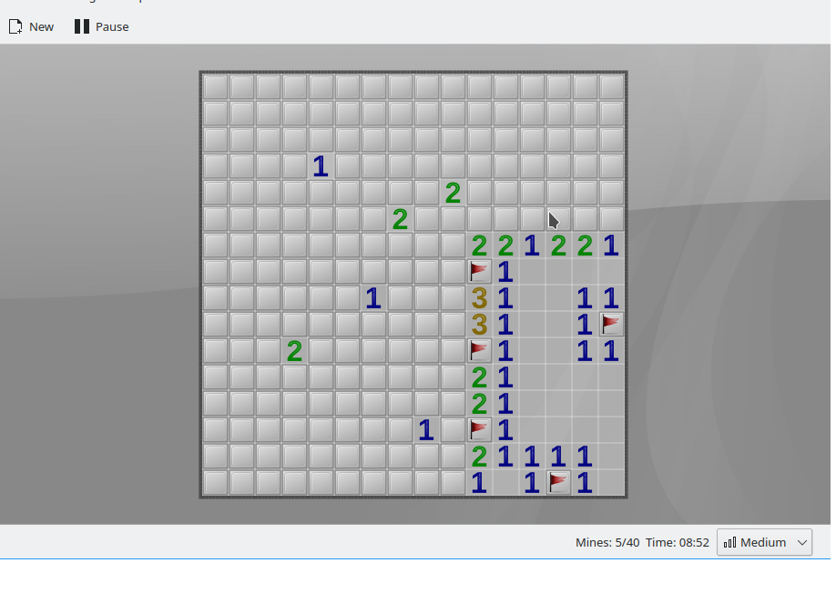

# Designing a better player experience for minesweeper
## The game
Minesweeper as a game is widely known and has lots of variants. In this context, the following variant is considered (which is implemented in KDE's KMines and MS Windows Minesweeper programs):

* A quadratic grid is made up of cells, which can either be open or closed.
* Each cell either contains one mine or the number of mines in the 8 cells around of it (which can be open or closed).
* At a closed cell, the player can either put a flag there as an indication of a mine, or they can open the cell. This action constitutes one move in the game.
* The game has no time limit, and the player is scored on the length of the game - the faster, the better.
* The player loses the game when he opens a cell with a mine. So the player has only one life in the game.
* The player wins the game when he opens all cells without mines and correctly flags all mined cells.
* There is never a mine on the first cell opened by the player (not guaranteed by KMines).
* Only a limited, but known number of mines are hidden on the grid.

## The issue
After several turns, the player might arrive at a configuration of the grid, in which the available information is not sufficient to make a safe move. In order to advance, the player then has to resort to guessing which cell could be safe or could be a mine. Here is an example of such a situation in KMines:

This in itself, is already mildly frustrating, because Minesweeper is a logic game and hence, the player should be able to solve it based on logic alone.  
Also, if the player's guess is wrong, the game is lost, which is very frustrating, especially for larger grids. The player invested tens of minutes to arrive at a certain situation, and then loses the game, so all his work so far is also lost.

## The possible solutions
There are several options to avoid the issue described above:

1. The program (the programmed logic) could create only solvable grids. I have not seen any implementation and I am not sure this is actually feasible, as the player can open the grid cells in any order, so the available information to him depends on this order, which cannot be foreseen by the program (You could point to https://www.chiark.greenend.org.uk/~sgtatham/puzzles/js/mines.html, which claims to be always solvable by deduction alone. In my tests, there were instances that I could not solve this way.)
1. The program could grant the player more than one life, so that wrong guesses will not immediately lead to losing the game. Drawback: the player still needs to guess and the number of necessary, but wrong guesses might exceed the available lives, leading again to losing.
1. In an ambiguous situation, the program could provide hints to the player that they could use to solve the game by deduction alone. For example, the program could open additional cells which provide sufficient information. This approach makes it necessary for the program to understand whether a given configuration is ambiguous or not.
1. In an ambiguous situation, the program could guarantee that each guess is safe by shuffling around the mines in the grid in accordance with the information revealed so far. For this approach, the program also needs to recognize ambiguous situations and also needs to move mines to new cells. Drawbacks: mines tend to cluster in the remaining closed cells and the player is still required to guess. Example implementation: https://pwmarcz.pl/kaboom/ 

The only alternative without guessing is #3, so I'll have a closer look at that. Please leave me a message on Github, if you see other options.

## Solution design
### Introduction
There are a number of available solvers for Minesweeper, e.g. [a probabilistic one](https://mrgris.com/projects/minesweepr/), or a [deterministic one](https://www.gecode.org/doc-latest/reference/classMineSweeper.html). The problem with these kinds of solvers is that they solve the whole game, i.e. they try to place all mines. [This computational task is exponentially hard](https://arxiv.org/abs/1204.4659).
Also, intermediary grid configurations allow for a large number of potential solutions, so the desired solution is not uniquely identifiable. So these approaches are not helpful for guaranteeing a better player experience.

The solution suggested here does not try to solve the whole game, but only solve the current game state in order to determine, if the next move is deterministic or probabilistic, i.e. if the player needs to guess or not. The program does not need to shuffle mines around, it just opens additional cells.

### Program  logic
I would like to demonstrate the logic with an example. Let's take the screenshot from above: the areas enclosed in red contain the cells that the program would need to look at for solvability. The areas only cover a small part of the grid, so the problem remains computationally tractable.

The following steps happen after every move of the player:
1. The program determines all cells for which there is any information available - those are the cells with the red boundary. If the areas are non-overlapping, each area will be solved individually. In the end, at least one area needs to be uniquely and deterministically solvable. The solver uses the total number of mines only as an upper limit, but it does not need to place them all.
1. The program looks at the whole grid and checks whether the grid has one unique solution under the additional constraint of placing all available mines. The program does not calculate all solutions, but only checks if there are more than one.
1. If the program determines that there is a deterministic solution, the player is informed about it; no further actions are taken.
1. If the program determines that there is no deterministic solution, the player receives a warning message and a question whether a hint should be revealed. The hint contains a safe grid cell to open. The player is still free to guess, or they choose to reveal the hint and take the move.

### UI changes

Here the UI, if the next move is deterministic and the grid is solvable:

Here the UI, if the next move must be guessed and the grid is unsolvable. There is an additional button that reveals a hint, if the player likes one.

## Implementation
Checking whether a given area of the grid has a unique solution is a constraint satisfaction problem, and we can use [Gecode](https://www.gecode.org/doc-latest/reference/index.html) to model and solve such problems. There is already an example program available for Minesweeper in the Gecode software package.

The implementation is ongoing. The KDE KMines game will act as the graphical front-end.

